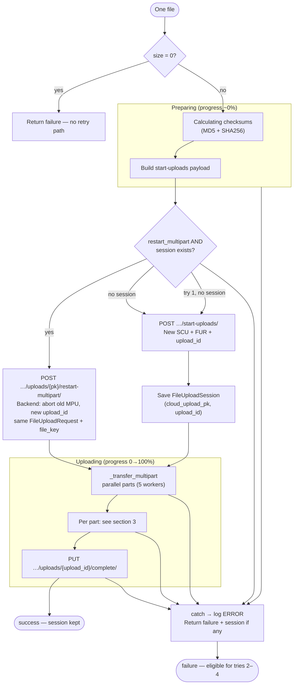
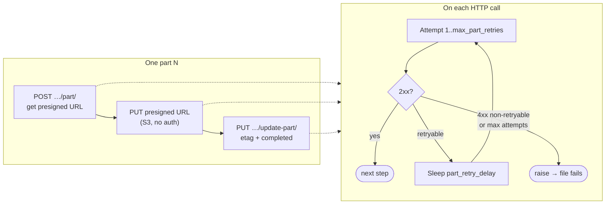
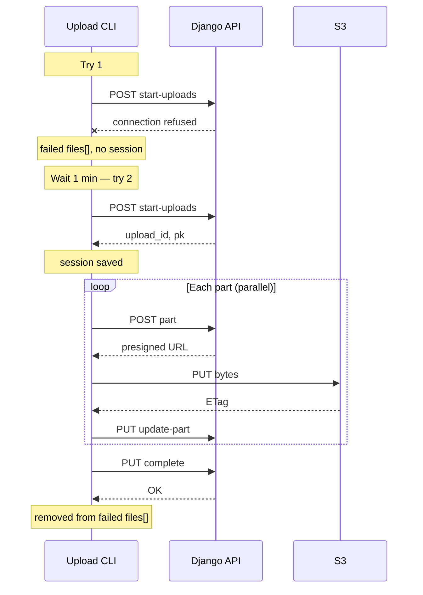
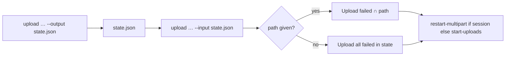

# GFBio submission cloud upload CLI — process flow

Reference for `scripts/gfbio_submissions_upload_progress.py` (`upload` command): batch tries, per-file lifecycle, part-level retries, and API/S3 interactions. Intended for external documentation (e.g. Jira); not wired into the application docs.

**Related code:** `gfbio_submissions/brokerage/utils/cloud_upload_multipart.py` (`restart-multipart`).

### Terminology

| Term | Meaning |
|------|---------|
| **failed files[]** | In-memory list of absolute paths not uploaded yet (code variable `failed`). Empty means every targeted file succeeded. |
| **Try** | One batch run (`_run_upload_pass`) over a set of files. **Try 1** = all files from `PATH` or `--input`. **Tries 2–4** = only paths still in failed files[] (the script logs these as “retry round 1/2/3”). |
| **Session** | Server upload slot (`cloud_upload_pk`, `upload_id`) stored in `sessions[path]` after `start-uploads` (or updated after `restart-multipart`). |

The process exits **once** at the end: if failed files[] is non-empty → exit code 1; if empty → exit code 0 and log the edit URL. Between tries, the code only checks whether to **skip further tries** (`if not failed: break`) — not a second exit decision.

---

## 1. Batch orchestration (`upload`)

```mermaid
flowchart TB
    START([upload: resolve file list]) --> T1

    subgraph TRY1["Try 1 — all files"]
        T1["_run_upload_pass<br/>restart_multipart = false"]
        T1 --> UP1["For each file: upload_file_direct"]
        UP1 --> S1{success?}
        S1 -->|yes| OK1["Remove path from failed files[]<br/>Store session in sessions{path}"]
        S1 -->|no| F1["Add path to failed files[]<br/>Keep session if start-uploads ran"]
    end

    TRY1 --> LOOPCHK{failed files[] empty?}

    subgraph TRIES2_4["Tries 2–4 (up to 3 extra, built-in)"]
        LOOPCHK -->|yes| BATCH_DONE
        LOOPCHK -->|no| WAIT["Sleep before next try<br/>(1 min → 5 min → 10 min)"]
        WAIT --> T2["_run_upload_pass<br/>only failed files[]<br/>restart_multipart = true"]
        T2 --> UP2["upload_file_direct<br/>each path in failed files[]"]
        UP2 --> S2{success?}
        S2 -->|yes| OK2["Remove from failed files[]"]
        S2 -->|no| F2["Stay in failed files[]"]
        F2 --> LOOPCHK2{failed files[] empty OR<br/>no tries left?}
        LOOPCHK2 -->|more to retry| WAIT
        LOOPCHK2 -->|done| BATCH_DONE
    end

    BATCH_DONE([all tries finished]) --> EXITCHK{failed files[] empty?}
    EXITCHK -->|yes| EXIT0([exit 0 — log edit URL])
    EXITCHK -->|no| EXIT1([exit 1 — failed files[] not empty])
```

**Batch rules**

- One file failing does not stop others in the same try.
- `sessions[path]` is updated whenever `upload_file_direct` returns a session (success or failure after `start-uploads`).
- `LOOPCHK` only decides whether to run another try; **exit code** is chosen once in `EXITCHK` after all tries (matches `if not failed: break` then `if failed: exit 1` in code).

---

## 2. Single file (`upload_file_direct`)



### Try 1 vs tries 2–4 (session choice)

| Try | `restart_multipart` | Session in `sessions` | API call |
|-----|---------------------|------------------------|----------|
| 1 | `false` | — | `start-uploads` |
| 2–4 | `true` | none (failed before start) | `start-uploads` again |
| 2–4 | `true` | exists (failed mid-upload) | `restart-multipart` |

**API unreachable on try 1:** no session is stored → a later try calls `start-uploads` again (not `restart-multipart`).

---

## 3. One part (request-level retries)

Each API/S3 step uses `_request_with_retry` (default **3** attempts, **1.5s** between attempts).



**Retryable status / errors:** `429`, `500`, `502`, `503`, `504`; `ConnectionError`, `TimeoutError`, `OSError`.

### Typical failure sources

| Symptom | Layer | Part retries? | Extra file try (2–4)? |
|---------|--------|---------------|------------------------|
| API unreachable / deploy | Django `start-uploads` / `restart-multipart` | Yes (if connection/5xx) | Yes — `start-uploads` if no session |
| `restart-multipart` HTTP 500 | Django → S3 `create_multipart_upload` fails | Yes on POST | Yes — same session, restart again |
| DNS / no internet on PUT | S3 presigned URL | Yes on PUT | Yes — restart or start-uploads |
| 401 / 403 / 400 | Auth / validation | No (not retryable) | Only after fixing cause and re-running |
| One part exhausts retries | Part loop | — | Path stays on failed files[] |

---

## 4. Example: API down on try 1, then recovery



If try 1 reached `start-uploads` but failed on a part, try 2 uses `restart-multipart` (abort old MPU, new `upload_id`, same `file_key`), then re-uploads all parts from scratch.

---

## 5. HTTP endpoints (per file)

| Step | Method | Path |
|------|--------|------|
| Start (try 1 or try 2–4 without session) | `POST` | `/api/submissions/{broker_submission_id}/start-uploads/` |
| Restart (try 2–4 with session) | `POST` | `/api/submissions/{broker_submission_id}/uploads/{pk}/restart-multipart/` |
| Presigned part URL | `POST` | `/api/submissions/uploads/{upload_id}/part/` |
| Upload bytes | `PUT` | presigned S3 URL (no auth header) |
| Register part | `PUT` | `/api/submissions/uploads/{upload_id}/update-part/` |
| Finish | `PUT` | `/api/submissions/uploads/{upload_id}/complete/` |

---

## 6. Built-in tuning (not CLI flags)

These values are fixed in the script so operators do not need to adjust them. Change the constants in `gfbio_submissions_upload_progress.py` only if you have a specific reason.

| Level | Constant / setting | Value | Behavior |
|-------|-------------------|-------|----------|
| Part | `DEFAULT_PART_RETRIES` | 3 | Per HTTP call in part/complete/start |
| Part | `PART_RETRY_DELAY_S` | 1.5s | Between part-level attempts |
| File | `DEFAULT_FILE_RETRY_ROUNDS` | 3 | Extra tries after try 1 (tries 2–4) |
| File | `DEFAULT_FILE_RETRY_DELAYS_S` | 1 / 5 / 10 min | Wait before tries 2–4 (`60`, `300`, `600` seconds) |
| Multipart | `DEFAULT_MULTIPART_PART_SIZE_BYTES` | 500 MiB | S3 part size (aligned with backend) |
| Part upload | `DEFAULT_MAX_PART_WORKERS` | 5 | Parallel part PUTs per file |
| File upload | `DEFAULT_MAX_FILE_WORKERS` | 3 | Files uploaded in parallel |
| HTTP | `HTTP_READ_TIMEOUT_S` | 600s | Single `urllib` timeout per request (`HTTP_CONNECT_TIMEOUT_S` is defined but not wired separately) |

### User-facing `upload` flags

| Flag | Purpose |
|------|---------|
| `--api-url` | Site root (`API_BASE` env fallback) |
| `--broker-submission-id` | Submission UUID |
| `--token` | API token (`API_TOKEN` env fallback) |
| `path` | Single file or directory to upload |
| `--recursive` | Recurse into directories |
| `--output` / `--input` | Persist / resume failed uploads |

Uploads always use `meta_data=false` and `attach_to_ticket=false` (same as typical profile UI data-file uploads). Mark metadata or Jira attachment in the web UI if needed.

Checksums (MD5 + SHA256) are always calculated before `start-uploads`.

---

## 7. Backend: `restart-multipart`

On an existing `FileUploadRequest`:

1. Abort in-progress multipart sessions for that request.
2. Reset request fields (status `PENDING`, clear `s3_location`, update hashes/size/type).
3. `create_multipart_upload` on the **same** `file_key`.
4. Reuse the existing `MultiPartUpload` row (update `upload_id`, `parts_expected`), delete old `UploadPart` rows, create fresh parts; response includes new `upload_id`.

The CLI keeps the same `cloud_upload_pk` and only updates `upload_id` in memory — no duplicate `SubmissionCloudUpload` / `FileUploadRequest` on file retry when a session already exists.

---

## 8. Progress UI (TTY)

Per file, progress reflects **upload bytes only**:

- **Preparing:** calculating checksums (MD5 + SHA256), then `start-uploads` / `restart-multipart` → bar stays at 0%
- **Uploading:** parts completing → 0–100%
- **Completing:** `complete` call → 100%

---

## 9. Persisted state (`--output` / `--input`)

After a run (or on failure), `--output FILE` writes JSON with the same structure as the in-memory retry state:

| Field | In-memory equivalent |
|-------|----------------------|
| `failed` | JSON field for failed files[] (absolute paths still failing) |
| `sessions` | map path → session (only paths on the failed files[] that reached `start-uploads`) |
| `errors` | map path → last error message |

Paths **without** an entry in `sessions` failed before `start-uploads` (API down, etc.). On resume they get `start-uploads` again; paths **with** `sessions` get `restart-multipart`.

Also stored: `version`, `broker_submission_id`, `api_url`. On resume, `broker_submission_id` must match the state file (hard error). `api_url` is compared to `--api-url` and only logs a **warning** if it differs.

### Example state file

```json
{
  "version": 1,
  "broker_submission_id": "550e8400-e29b-41d4-a716-446655440000",
  "api_url": "https://submissions.gfbio.org/",
  "failed": [
    "C:/data/run1.fastq.gz",
    "C:/data/run2.fastq.gz"
  ],
  "sessions": {
    "C:/data/run2.fastq.gz": {
      "file_path": "C:/data/run2.fastq.gz",
      "cloud_upload_pk": 42,
      "upload_id": "abc…",
      "meta_data": false,
      "attach_to_ticket": false
    }
  },
  "errors": {
    "C:/data/run1.fastq.gz": "Connection refused",
    "C:/data/run2.fastq.gz": "HTTP 500 for POST …/restart-multipart/"
  }
}
```

### Resume flow



**CLI examples**

```bash
# First run; write state for anything still failing
python3 scripts/gfbio_submissions_upload_progress.py upload \
  --api-url=... --broker-submission-id=UUID --token=... \
  --recursive --output upload-state.json ./datadir

# Later: only failed files that live under ./datadir
python3 scripts/gfbio_submissions_upload_progress.py upload \
  --api-url=... --broker-submission-id=UUID --token=... \
  --input upload-state.json --recursive --output upload-state.json ./datadir

# Or resume every failed path in the state file (no path argument)
python3 scripts/gfbio_submissions_upload_progress.py upload \
  --api-url=... --broker-submission-id=UUID --token=... \
  --input upload-state.json --output upload-state.json
```

With `--input`, every path in the state file’s `failed` field (failed files[]) is retried (removed only after a successful upload). Tries 2–4 still run while failed files[] is non-empty. `--output` is updated in a `finally` block so it is written even when the process exits with code 1.

---

## 10. End-to-end overview (single diagram)

Full `upload` flow in one view: CLI entry, resume, batch tries, per-file lifecycle (up to 3 files × 5 parts in parallel), HTTP/S3 steps with retries, progress, and a **single** exit check on the failed files[]. See sections 1–9 for detail.

```mermaid
%%{init: {'flowchart': {'nodeSpacing': 32, 'rankSpacing': 52, 'curve': 'basis'}}}%%
flowchart LR

    subgraph C1["① CLI"]
        direction BT
        RUN(["upload"])
    end

    subgraph C2["② Paths"]
        direction BT
        INP{"--input?"}
        INP -->|no| FRESH["collect_upload_paths"]
        INP -->|yes| LOAD["load state.json"]
        LOAD --> FP{"path filter?"}
        FP -->|yes| SUB["failed ∩ path"]
        FP -->|no| ALL["all failed"]
        FRESH --> FLIST[("file list")]
        SUB --> FLIST
        ALL --> FLIST
        FLIST --> ROK{"paths + state OK?"}
        ROK -->|no| DIE_PATH(["exit: bad path / state"])
    end

    subgraph C3["③ Batch tries"]
        direction BT
        APIURL{"api-url set?"}
        APIURL -->|no| DIE_API(["exit: API_BASE"])
        APIURL -->|ok| PROG["progress UI"]
        PROG --> T1IN{"--input resume?"}
        T1IN -->|no| T1F["Try 1: fresh<br/>restart=false · failed[] empty"]
        T1IN -->|yes| T1R["Try 1: resume<br/>restart=true · failed[]=files"]
        T1F --> POOL["thread pool ≤3 files<br/>token check per worker"]
        T1R --> POOL

        subgraph ONEFILE["④⑤ Per file — one pool slot"]
            direction BT
            SZ{"size > 0?"}
            SZ -->|no| FFAIL(["failure"])
            SZ -->|yes| HASH["checksums MD5+SHA256"]
            HASH --> API{"restart_multipart<br/>and session?"}
            API -->|yes| RESTART["POST restart-multipart"]
            API -->|no session| START["POST start-uploads"]
            RESTART --> SESS[("session")]
            START --> SESS
            SESS --> PARTS["all parts in parallel ≤5<br/>each part: POST part → PUT S3 → PUT update-part"]
            PARTS --> COMP["PUT …/complete/"]
            COMP --> OK(["success"])
            HASH -.->|error| FERR
            RESTART -.->|error| FERR
            START -.->|error| FERR
            PARTS -.->|error| FERR
            COMP -.->|error| FERR
            FERR["failed files[] · errors{}"]
            FERR --> FFAIL
        end

        POOL -->|"open slot"| SZ
        OK --> TRY_DONE["pool done · update failed[] / sessions"]
        FFAIL --> TRY_DONE
        TRY_DONE --> LOOPCHK{"failed files[] empty?"}
        LOOPCHK -->|yes| BATCH_END["all tries done"]
        LOOPCHK -->|no| MORETRY{"more tries 2–4 left?"}
        MORETRY -->|yes| WAIT["sleep 1 min · 5 min · 10 min"]
        WAIT --> TRY24["Try 2–4: retry<br/>restart=true · failed[] only"]
        TRY24 --> POOL
        MORETRY -->|no| BATCH_END
    end

    subgraph C6["⑥ Finish"]
        direction BT
        EXITCHK{"failed files[] empty?"}
        EXITCHK -->|yes| E0(["exit 0 · log edit URL"])
        EXITCHK -->|no| E1(["exit 1"])
        EXITCHK -.->|if --output| STATE["write state.json (finally)"]
    end

    RUN --> INP
    ROK -->|ok| APIURL
    BATCH_END --> EXITCHK
    FLIST -.->|next run --input| LOAD

```



Read **left → right** across **① → ② → ③ → ⑥**. **②** runs before any API call (missing files, empty state, path mismatch, broker ID mismatch → `DIE_PATH`). **③** checks `--api-url` next; each pool worker checks `--token` when upload starts. **③** and **④⑤** use `direction TB`. Cross-column links: `RUN`→`INP` (bottom of ①→②), `ROK`→`APIURL` (②→③), `BATCH_END`→`EXITCHK` (③→⑥).

**③** is the main loop: each **try** runs a **thread pool** (≤3 files). **Try 1: fresh** vs **Try 1: resume** (`restart_multipart` and initial `failed[]` differ). **Try 2–4: retry** always uses `restart_multipart=true` and only paths still in `failed[]`. Every active file runs **④⑤** once; when the pool is done, **try finished** updates `failed[]` / `sessions`, then the loop decides another try. Inside **④⑤**, all parts upload **in parallel** (≤5 workers); each part’s three HTTP steps still run in order, each with up to 3 retries (1.5s) — see sections 3 and 6. **⑥** is the only success/failure exit on `failed[]`; `--output` runs in `finally` regardless. Dotted lines = errors or a later `--input` resume.
